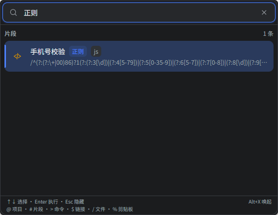
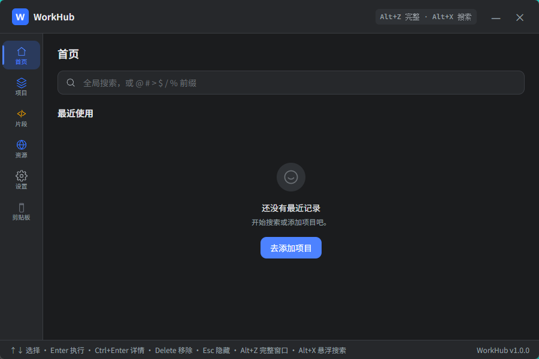
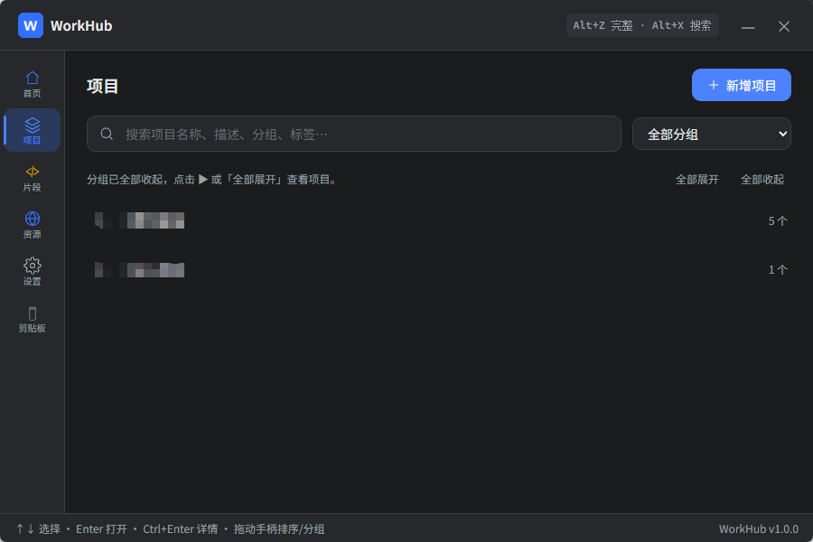
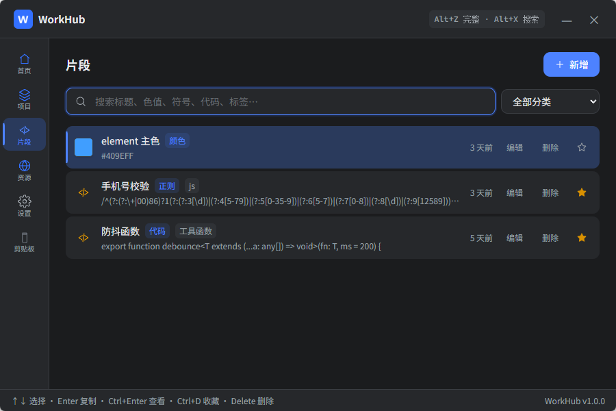
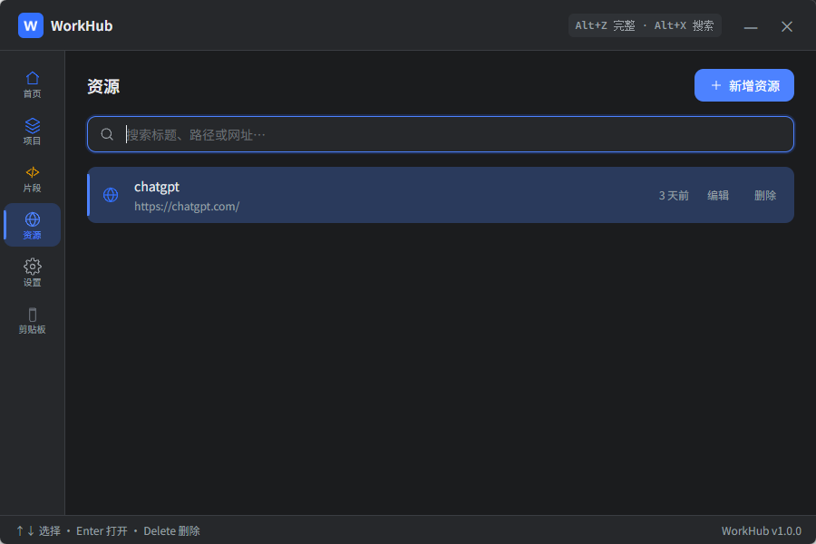
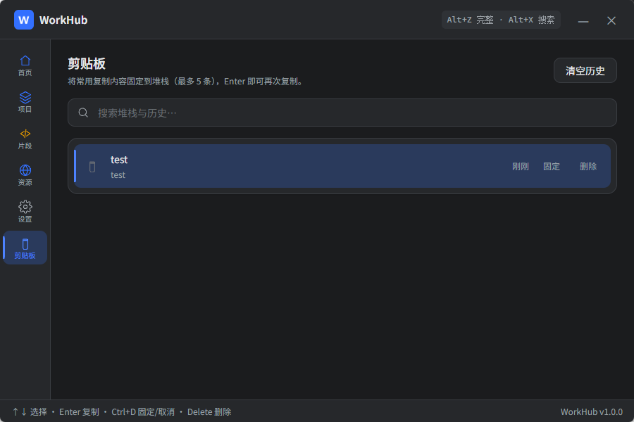
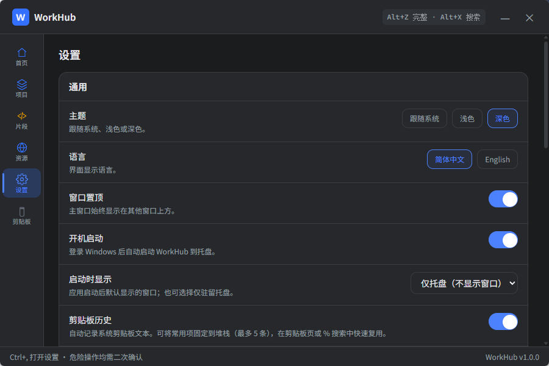

# WorkHub

**键盘优先的开发者效率工具** —— 把项目、代码片段、常用资源与剪贴板历史集中在一处，用搜索和快捷键完成日常高频操作。

WorkHub 基于 [Tauri 2](https://v2.tauri.app/) 构建，数据全部存储在本地 SQLite，无需联网即可使用核心功能。支持悬浮搜索窗与完整主窗口两种形态，适合在写代码、查资料、切换项目时快速唤起。



---

## 功能概览

| 模块 | 说明 |
|------|------|
| 首页 | 全局搜索入口、最近使用记录聚合 |
| 项目 | 本地项目管理、分组、收藏、快速启动 VSCode |
| 片段 | 代码、色值、符号、正则等可复用内容管理 |
| 资源 | 文件、文件夹、链接等常用资源一键打开 |
| 剪贴板 | 自动记录剪贴板历史，支持固定常用内容 |
| 设置 | 主题、语言、快捷键、数据导入导出、自动更新 |

---

## 界面预览

### 首页 — 全局搜索与最近使用

唤起后即可输入搜索；无关键词时展示最近打开的项目、文件与复制的片段。支持前缀限定搜索范围。



**搜索前缀：**

| 前缀 | 范围 |
|------|------|
| `@` | 项目 |
| `#` | 片段 |
| `>` | 命令 |
| `$` | 链接 |
| `/` | 文件 |
| `%` | 剪贴板 |

### 悬浮搜索窗

轻量搜索面板，输入即搜、Enter 执行，适合在其他应用工作时快速调用。

默认快捷键：`Alt + X`

### 项目管理

支持多级分组（最多 3 层）、拖拽排序、收藏与标签筛选。Enter 用 VSCode 打开项目，Ctrl+Enter 进入详情页管理常用链接、命令与文档。



**项目详情包含：**

- 基础信息（名称、描述、路径、Git 地址、标签）
- 常用链接 — Enter 在浏览器打开
- 常用命令 — Enter 复制到剪贴板
- 项目文档 — 关联本地 PDF / Word / Excel / Markdown 等文件
- 快速启动 — 执行 `code <path>` 打开 VSCode

### 片段管理

保存常用代码、十六进制色值、符号 Emoji、正则表达式等，支持分类筛选与标签。Enter 一键复制，带 `{{变量名}}` 占位符的片段会在复制前弹出填写对话框。



**片段分类：** shell · git · sql · 代码 · 正则 · 颜色 · 符号 · 其他

### 资源收藏

集中管理常用链接、本地文件、文件夹，搜索后 Enter 即可打开。



### 剪贴板历史

自动记录系统剪贴板文本，可将常用内容固定到堆栈（最多 5 条），Enter 再次复制。也可在全局搜索中用 `%` 前缀快速检索。



### 设置中心

主题（跟随系统 / 浅色 / 深色）、界面语言（简体中文 / English）、窗口置顶、开机启动、启动时显示方式、剪贴板历史、全局快捷键、数据导入导出与自动更新。



---

## 快捷键

### 全局

| 快捷键 | 行为 |
|--------|------|
| `Alt + X` | 唤起 / 聚焦悬浮搜索窗（可在设置中修改） |
| `Alt + Z` | 唤起 / 聚焦完整主窗口（可在设置中修改） |
| `Ctrl + ,` | 打开设置 |
| `Esc` | 清空搜索 / 关闭弹窗 / 隐藏窗口到托盘 |

### 列表通用

| 快捷键 | 行为 |
|--------|------|
| `↑` `↓` | 选择上一项 / 下一项 |
| `Enter` | 执行主操作（打开、复制等，因类型而异） |
| `Ctrl + Enter` | 打开详情 |
| `Ctrl + C` | 复制可复制内容 |
| `Ctrl + D` | 收藏 / 取消收藏 |
| `Delete` | 删除（需二次确认） |

### 主操作约定

| 类型 | Enter 行为 |
|------|-----------|
| 项目 | 用 VSCode 打开 |
| 片段 | 复制到剪贴板 |
| 命令 | 复制到剪贴板 |
| 链接 / 网址 | 默认浏览器打开 |
| 文件 / 文件夹 | 系统默认方式打开 |
| 剪贴板条目 | 再次复制 |

---

## 技术栈

- **前端：** Vue 3 + TypeScript + Tailwind CSS 4 + vue-i18n
- **桌面端：** Tauri 2（Rust）
- **数据存储：** SQLite（`tauri-plugin-sql`）
- **其他：** 系统托盘、全局快捷键、剪贴板监听、开机自启、应用内更新

---

## 环境要求

- [Node.js](https://nodejs.org/) 18+
- [Rust](https://www.rust-lang.org/tools/install)（Tauri 构建所需）
- Windows 10 / 11（当前主要发布平台）

---

## 开发

```bash
# 安装依赖
npm install

# 启动开发模式（Vite + Tauri）
npm run tauri dev

# 构建生产版本
npm run tauri build
```

仅启动前端预览（数据不会持久化）：

```bash
npm run dev
```

---

## 数据与安全

- 所有业务数据存储在本地 SQLite 数据库，完全离线可用
- 支持 JSON 导出 / 导入、数据库备份与恢复
- 危险操作（删除、覆盖导入等）均需二次确认
- 关闭窗口默认最小化到系统托盘，退出需从托盘菜单操作

---

## 系统托盘

- 左键单击托盘图标：显示并聚焦主窗口
- 托盘菜单：显示主窗口 / 设置 / 退出程序

---

## 版本

当前版本：**v1.0.0**

---